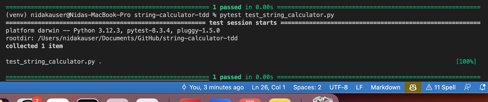
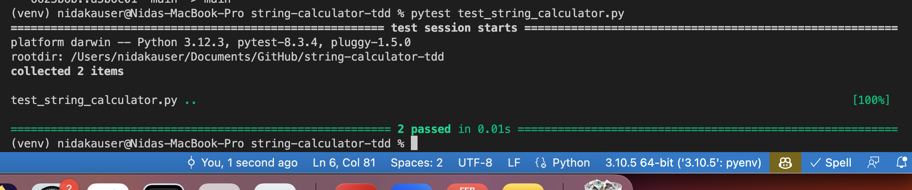
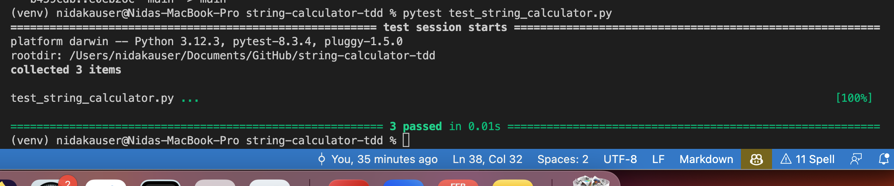
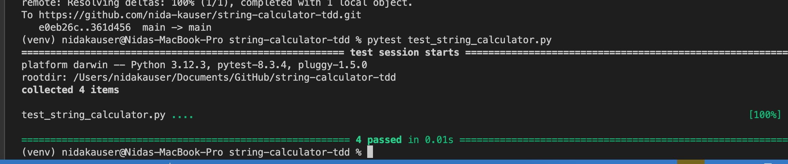

# Overview

This project implements the String Calculator TDD Kata in Python, following the Test-Driven Development (TDD) approach using pytest.

# Setup Instructions

1. Clone the Repository

# Use command to clone with SSH

 git clone git@github.com:nida-kauser/string-calculator-tdd.git   

 2. Create and Activate Virtual Environment

<!-- create VENV -->
 python3 -m venv venv  

 <!-- Activate VENV -->
 Windows (Command Prompt): venv\Scripts\activate
 Mac/Linux: source venv/bin/activate

 3. Install Dependencies

 pip install -r requirements.txt

 4. Run the tests
  pytest test_string_calculator.py

Screenshots

Test case 2: Handle Single Number

Test case 3: Handle Two Numbers

Test case 4: Handle Newline (\n) 

Test case 5: Handle Custom/Different delimiters

